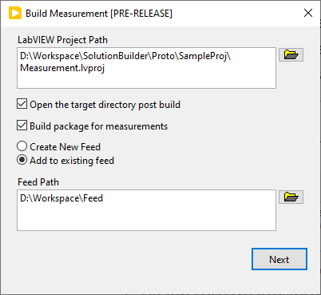
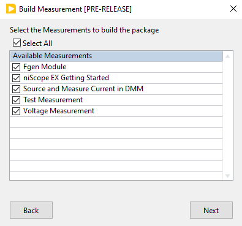
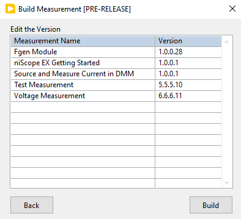
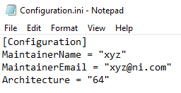

# Measurement Reuse Workflow

- [Measurement Reuse Workflow](#measurement-reuse-workflow)
  - [Problem Statement](#problem-statement)
  - [Links To Relevant Work Items and Reference Material](#links-to-relevant-work-items-and-reference-material)
  - [How to launch the tool?](#how-to-launch-the-tool)
  - [How to build package?](#how-to-build-package)
  - [Implementation/Design](#implementationdesign)
    - [Populating measurement](#populating-measurement)
    - [Version tracker](#version-tracker)
    - [Building EXE and PPL](#building-exe-and-ppl)
    - [Building Package](#building-package)
    - [Creating/Adding to Feed](#creatingadding-to-feed)
  - [Future Plans](#future-plans)
## Problem Statement

> The measurement plug-in comes with two build specifications. PPL for the measurement ui and EXE for the measurement logic. 
> The measurement exe build specification has post build action VI which makes creation of installer or package difficult.
> The measurement builder tool solves the problem by providing an easy way to build measurement plug-in service as the NI Package.

## Links To Relevant Work Items and Reference Material

- [Feature 2701542: Productize the LabVIEW measurement builder](https://dev.azure.com/ni/DevCentral/_workitems/edit/2778273)
- [Prototype Source code]()
- [Prototype Demo Recording](https://nio365.sharepoint.com/:v:/r/sites/ModernLabReferenceArchitecture/Shared%20Documents/Recordings/Measurement%20Builder%20Utility%20LabVIEW%20-%20Demo/LabVIEW%20Measurement%20Builder%20Demo.webm?csf=1&web=1&e=TCMsdK)

## How to launch the tool?

The measurement builder can be launched from `LabVIEW->Tools->Plug-Ins->Measurement->Build Measurement`

## How to build package?

User should provide the following inputs
1. LabVIEW project path

If there is a project opened, the labview project path will be used as a default path. Else, the path will be empty. If invalid directory is provided, warning will be shown and `Next` button will be disabled.

2. Open the target directory post build.

Enabling this option will open the package file directory post build, if `Create Package` is checked else, exe directory will be opened. If unchecked, no action will be performed.

3. Create package for the measurements.

Enabling this option will create NI package for the measurements. Else, the tool builds the EXE and PPL (if present) for the measurement.

4. Option to create feed for the package or add package to an existing feed.

This option will be enabled only if package creation option is checked. Users can create new feed for the packages or add packages to existing feed or skip feed creation. If `Add to existing feed` is selected, path for the existing feed should be provided as input. If invalid directory is provided, warning will be shown and `Next` button will be disabled.

Once the above inputs are provided, and upon clicking `Next`, the measurements available in the project will be populated. Users can select the measurement which should be built into the package.

Upon clicking `Next` in the above page, version details of the measurement are shown. Double click the version to edit. The version details are loaded from the EXE build specification.

On clicking `Build`, the PPL(if present) and EXE are built first and then NI Package are built which comprises of PPL and EXE of the measurement. The status of the build is shown after building all the selected measurements.

## Implementation/Design

### Populating measurement

The tool fetches all the EXE build specification of the project and populates them.

### Version tracker
Once the measurement are selected, version details should be tracked when user builds the same measurement for the second time.
To achieve this functionality, the version details are populated from the EXE build specification while opening the Edit the Version page. Once the build is success, the version details are saved in the EXE and PPL build specification. Since, version details are populated from the build specification, the build number will increase only if auto-incerement is enabled in the build specification.

### Building EXE and PPL

EXE and PPL is built by the native LabVIEW Build.vi. If the EXE build directory already present,prior to build.

### Building Package

NI Packages for the measurement are built using the [Package creation using CLI](https://www.ni.com/docs/en-US/bundle/package-manager/page/build-package-using-cli.html#:~:text=Building%20a%20Package%20Using%20the%20Command%20Line%20Interface,package%20source%20files%3E%22%20%22%3Cdestination%20of%20.nipkg%20file%3E%22.%20).

A new directory folder `Packages`' is created parallel to the exe target directory. The output directory of the EXE build is moved to the another folder as needed to build the NI Package and the following fields are updated for all the measurements in the control file and instructions file. Control and instruction files are components required for building NI pkg using CLI. For more information, read [Package creation components](https://www.ni.com/docs/en-US/bundle/package-manager/page/package-components.html)
1. Package Name
2. Version
3. Displaye Name
4. Maintainer Name and Email ID
5. Target Directory
6. Architecture

Once the fields are set, packages are built using the CLI command.

Maintainer Name and Email ID is populated from the configuration file "C:\ProgramData\National Instruments\Measurement Builder\Configuration.ini". When the measurement builder is installed, the Maintainer name and email is populated from the User Name and Domain name of the system. Users can edit the maintainer and email ID.

### Creating/Adding to Feed
New feed for the packages is created using the [Feed creation using CLI](https://www.ni.com/docs/en-US/bundle/package-manager/page/creating-feed.html). New feed is created parallel to the `Packages` directory.
The packages are added to an existing feed using the [Adding package to feed using CLI](https://www.ni.com/docs/en-US/bundle/package-manager/page/add-package-to-feed.html)

## Future Plans
1. Option to upload the package to System Link Enterprise feed and automate the process.

